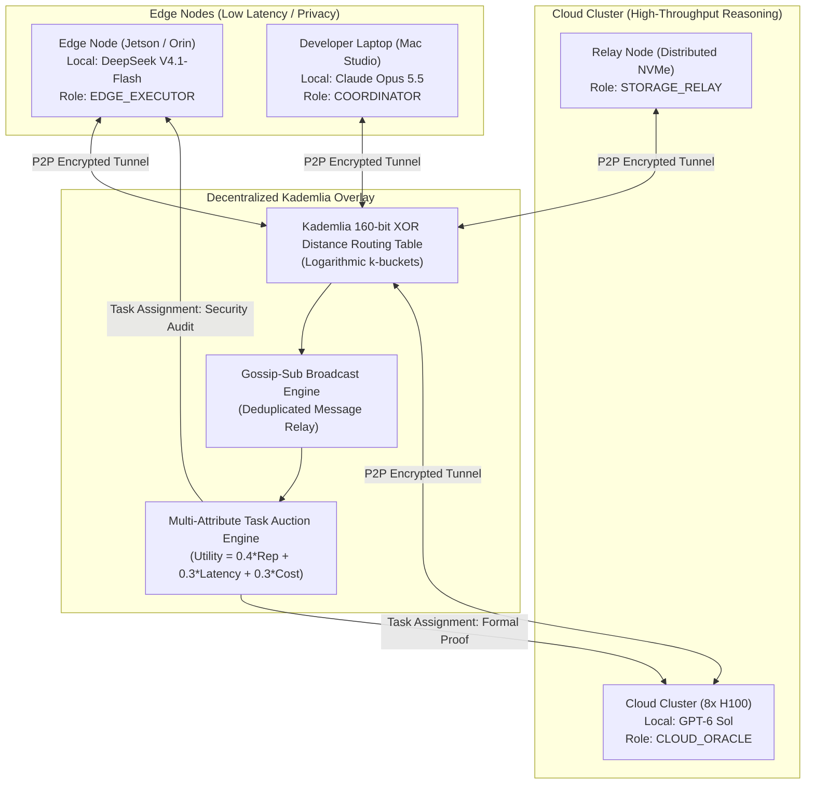

# ❖ Hyper-Mesh

> **Broker-Free P2P Kademlia Mesh Network for Distributed Frontier Agent Swarms**  
> Serverless peer discovery, logarithmic XOR metric routing, encrypted gossip propagation, and multi-attribute task auction consensus across edge nodes (**DeepSeek V4.1-Flash**) and cloud clusters (**GPT-6 Sol**, **Claude Opus 5.5**).

[](LICENSE)
[](https://python.org)
[]()
[]()

---

## ⚡ The Problem: The Fragile Central Message Broker

Today's multi-agent swarms rely on centralized cloud brokers (Redis, RabbitMQ, Kafka, central WebSockets):
1. **Single Point of Failure**: If the cloud coordinator restarts or experiences a network partition, all distributed agents collapse.
2. **Edge-to-Cloud Friction**: Coordinating agents across local developer laptops (Mac Studio), cloud H100 clusters, and edge devices requires complex ingress NAT configuration and firewall punching.
3. **Sub-Optimal Task Assignment**: Centralized brokers dispatch jobs without awareness of local model availability, latency, or compute pricing.

**Hyper-Mesh** provides a **Decentralized Sovereign Swarm Network**:
* **Kademlia DHT Peer Discovery**: Cryptographic node addressing and logarithmic XOR metric routing with zero central servers.
* **Resilient Gossip Broadcast**: Deduplicated gossip-sub protocol with hop-count boundaries that survives 50% node dropouts.
* **Multi-Attribute Task Auction**: Decentralized bidding balancing node reputation, model affinity, network latency, and execution cost.

---

## 📐 Architecture & P2P Mesh Topology



---

## 🚀 Key Modules
- **`hyper_mesh/dht_discovery.py`**: Implements 160-bit SHA-1 XOR distance metric and logarithmic k-bucket routing table.
- **`hyper_mesh/gossip_consensus.py`**: Deduplicated gossip propagation engine and multi-attribute task auction resolver.
- **`hyper_mesh/models.py`**: Data structures for `PeerNode`, `MeshMessage`, `TaskBidProposal`, and `NodeRole`.
- **`hyper_mesh/cli.py`**: Multi-node peer simulation and automated task auction demonstration.

---

## 🛠️ Installation & Usage

```bash
git clone https://github.com/AAH20/hyper-mesh.git
cd hyper-mesh
pip install -e .
```

### Run Demonstration
```bash
hyper-mesh --demo
```

### Run Unit Tests
```bash
python3 -m unittest discover tests
```
